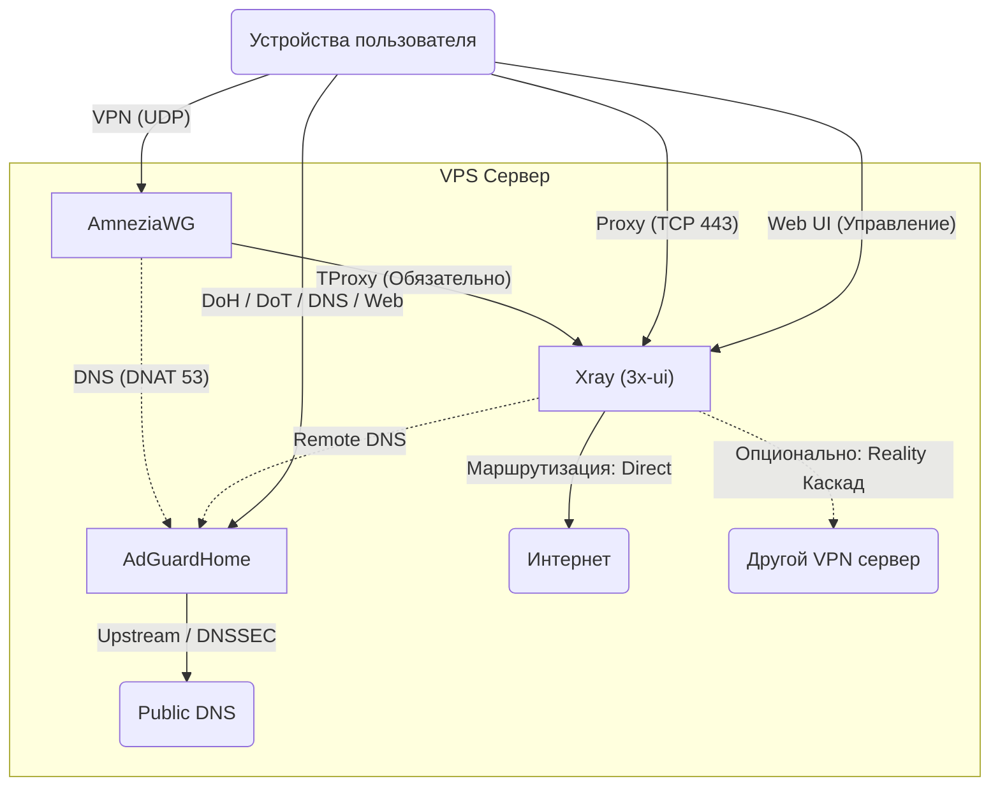

<!--
Name: 3x-awg-adg-bundle Architecture
Description: Архитектура и ключевые правила проекта для AI-агентов. Описывает суть, принципы и "жесткие" ограничения.
Usage: Прочитать перед внесением любых структурных изменений в setup.sh или логику взаимодействия компонентов.
Behavior: Определяет "DPI-first" и "Secure-by-default" подход.
-->

# Архитектура 3x-awg-adg-bundle

Этот документ описывает "ДНК" проекта — глубокие принципы и правила, которые делают этот бандл эффективным. Это не пересказ кода, а описание его логики.

## 1. Суть и Цели (The Essence)
Проект представляет собой **"DPI-Shield"** — автоматизированный бандл для развертывания защищенной экосистемы на VPS с минимальными ресурсами (от **512MB RAM**). 

**Ключевые цели:**
- **Zero-Touch Setup**: Одна команда для полной настройки и получения всех инструкций/QR-кодов.
- **Smart Security**: Защита от взлома "из коробки" (UFW, Fail2Ban, SSH 2244, Sysctl hardening).
- **Clean Content**: Блокировка рекламы, трекеров и Безопасный поиск (SafeSearch для Google, YT, Yandex) включены по умолчанию через AdGuardHome.
- **Reliable Access**: Использование последних трендов (AmneziaWG + Reality) для обхода DPI.

## 2. Архитектурный стек
- **Транспорт**: AmneziaWG (UDP) + Xray VLESS-Reality (TCP/443).
- **DNS**: AdGuardHome (фильтрация + SafeSearch по умолчанию).
- **Управление**: 3x-ui (панель управления Xray).
- **Безопасность**: UFW + Fail2Ban + SSH Hardening + Очистка инструментов сборки.

## 3. Глубинные принципы
### DPI Resistance (Приоритет №1)
- **Reality**: Мимикрия под легитимный TLS (google.com) на стандартном порту 443.
- **AWG**: Применение "мусорных" байт (Jc, Jmin...) и кастомных заголовков. Параметры *всегда* должны быть случайными, чтобы не создавать статичных отпечатков.

### Secure-by-Default & Obscurity
- **Никаких дефолтов**: SSH (2244), 3x-ui (2053 + случайный путь), AdGuardHome (случайный порт).
- **Случайные сущности**: Логины, пароли и пути генерируются при каждой установке. Код не должен полагаться на константы `admin/admin`.
- **Минимизация поверхности**: Инструменты сборки (`build-essential`, `git`) удаляются сразу после компиляции модуля AmneziaWG.

### Улучшенный DNS-процессинг (Universal DNS Hub)
- **Многоканальный доступ**: AGH доступен напрямую (DoH, DoT) и через туннели.
- **DNSSEC & Filtering**: Валидация запросов и блокировка рекламы на уровне всей VPS.
- **DNAT-перехват**: Внутри AWG-туннеля трафик на порт 53 принудительно уходит в AGH.

### Каскадная маршрутизация (Smart Routing Engine)
- **TProxy как стандарт**: Весь трафик из AmneziaWG принудительно поступает в Xray через прозрачное проксирование.
- **Интеллектуальный выбор**: Xray выступает как диспетчер, разделяя потоки:
    - *Direct Outbound*: Прямой выход для большинства ресурсов.
    - *Cascading Proxy*: Опциональное направление трафика на другой удаленный VPN-сервер (Reality/VLESS) для маскировки маршрута.

## 4. Что НЕЛЬЗЯ нарушать (Инварианты)
1. **Идемпотентность**: Повторный запуск скрипта должен обновлять конфигурации, но не «ломать» систему. Если компонент работает, скрипт должен это учитывать (Fast Mode).
2. **Изоляция трафика**: VPN-клиенты не должны иметь возможности обойти AdGuardHome. Весь DNS трафик из туннеля `awg0` обязан проходить через фильтр.
3. **Безопасность доступа**: Файл `/root/.vpn-credentials` — единственный источник правды о доступах. Его права доступа должны быть `600`.
4. **Порт 443**: Зарезервирован исключительно под Reality. Другие сервисы (панели управления) обязаны висеть на высоких случайных портах.

## 5. Механика жизненного цикла
- **Инициализация**: Проверка версии ОС (Debian vs Ubuntu) определяет метод получения AmneziaWG (PPA vs Build).
- **Генерация**: Параметры обфускации AWG генерируются через `shuf`. Они не должны повторяться.
- **Очистка**: Система очищается от временных файлов и кэша apt в конце работы.

## 6. Сетевая топология (Логика трафика)

---
*Документ предназначен для AI-агентов. При изменении логики setup.sh убедитесь, что новые функции не нарушают пункты 3 и 4.*
