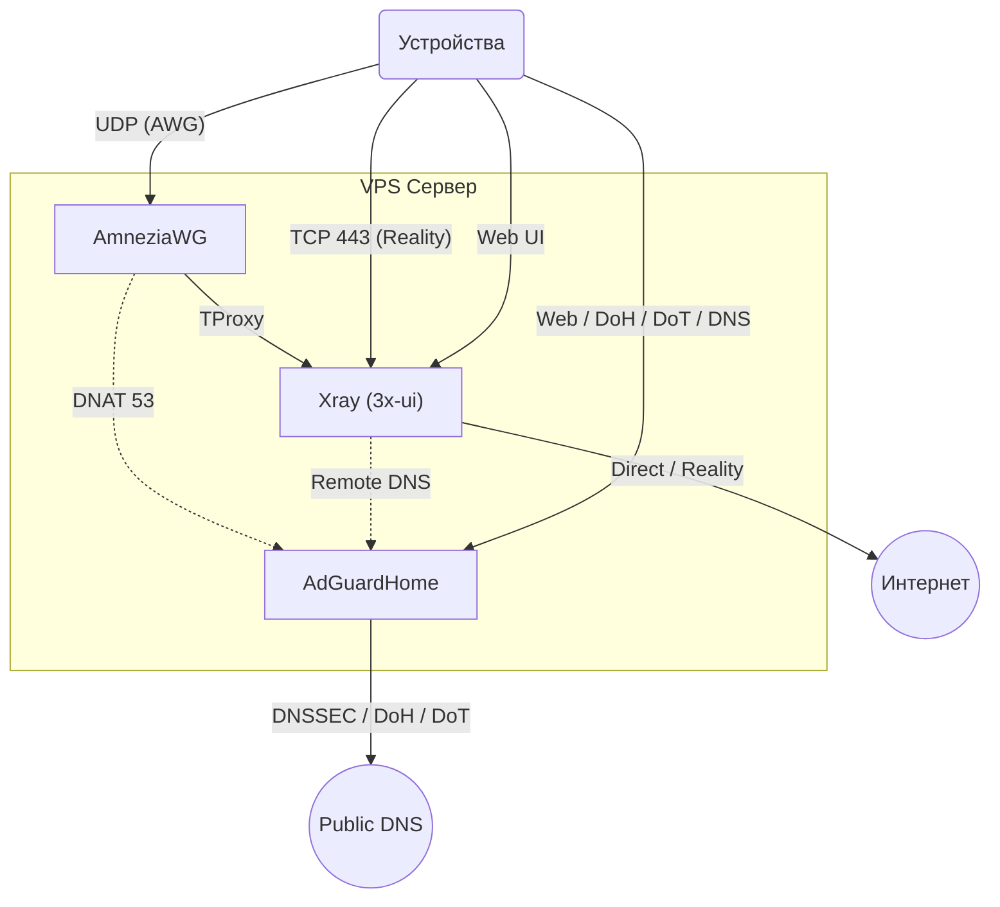

<!--
Name: 3x Architecture (Compact)
Description: Суть и правила проекта 3x-awg-adg-bundle для AI.
-->

# Архитектура 3x-awg-adg-bundle

Если рядом есть `.agents.local.md`, учитывать его как локальное дополнение к этим правилам. Содержимое этого файла не коммитить.

## 1. Суть и Стек

**Миссия:** "One-click" DPI-shield для VPS от **512MB RAM**.
**Стек:** AmneziaWG + Xray (Reality) + AdGuardHome (AGH) + 3x-ui.
**Цель:** Очищенный интернет (No Ads/SafeSearch) и обход блокировок "из коробки".

## 2. Ключевые правила (Инварианты)

- **Идемпотентность**: Скрипт обновляет, но не ломает. Повторный запуск — безопасен.
- **Изоляция DNS**: Никаких утечек. Весь трафик (VPN/Proxy) обязан идти через AGH.
- **Порт 443**: Зарезервирован строго под Reality.
- **Root-Only**: Управление ядром и фаерволом требует прав суперпользователя.

## 3. Логика маршрутизации

- **Traffic Hub**: Весь трафик из AmneziaWG всегда идет в Xray через **TProxy**.
- **Диспетчеризация**: Xray решает: прямо в интернет (Direct) или в каскад (Remote Proxy).
- **DNS Hub**: AGH доступен по DoH/DoT/UDP. Работает как Remote DNS для Xray и перехватчик (DNAT 53) для VPN.

## 4. Безопасность и Жизненный цикл

- **Obscurity**: Случайные порты, пароли и пути при каждой установке.
- **Hardening**: UFW + Fail2Ban + SSH (2244) + сетап BBR/sysctl.
- **Очистка**: Удаление инструментов сборки (`git`, `make`) сразу после компиляции.

## 5. Топология

