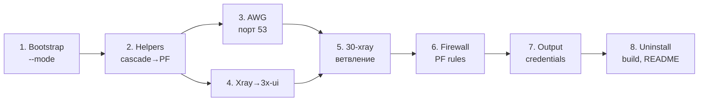

# План реализации: Target + Relay архитектура

> Задачи выполняются последовательно. Каждая — самодостаточный промпт для Codex.

---

## Задача 1. Рефакторинг bootstrap: режим `--mode target|relay`

**Роль:** Senior Shell Engineer, эксперт по модульным bash-инсталляторам.

**Суть:** Добавить CLI-аргумент `--mode target|relay` в `00-bootstrap.sh`. Это фундамент для ветвления всей логики. Без флага скрипт работает как раньше (backward-compatible, режим `target` по умолчанию).

**Задача (атомарные шаги):**
1. В `00-bootstrap.sh` добавить глобальную переменную `DEPLOY_MODE="target"`.
2. В парсер аргументов добавить `--mode` с валидацией: допустимы только `target` и `relay`.
3. При невалидном значении — `err "..."`.
4. Убрать `--cascade-vless` и `--cascade-mode` из парсера (deprecated).
5. Убрать все глобальные `CASCADE_*` переменные из bootstrap.
6. Добавить `log "Режим развёртывания: ${DEPLOY_MODE}"` после парсинга.
7. Обновить `SCRIPT_VERSION` до `3.0.0`.
8. Обновить заголовок Usage-комментария.

**TDD:**
- Регрессия: `SCRIPT_VERSION="3.0.0"` присутствует.
- Регрессия: `--mode` принимается как аргумент.
- Регрессия: `DEPLOY_MODE="target"` инициализируется.
- Регрессия: `--cascade-vless` и `--cascade-mode` **отсутствуют**.
- Регрессия: `CASCADE_VLESS_ARG` и все `CASCADE_*` переменные **отсутствуют** в bootstrap.

**Контекст:** Все модули ниже будут проверять `$DEPLOY_MODE` для ветвления. Файл [00-bootstrap.sh](file:///c:/Users/ivanm/Documents/Projects/3x-awg-adg-bundle/src/setup/00-bootstrap.sh).

**Формат:** Изменения в `src/setup/00-bootstrap.sh`. Обновить `script-regressions.ps1`.

**Ограничения:** Не трогать `10-helpers.sh` и другие модули. Cascade-функции в helpers удалятся в задаче 2.

---

## Задача 2. Очистка helpers от cascade, добавление Port Forwarding функций

**Роль:** Senior Shell Engineer, эксперт по iptables и L4 forwarding.

**Суть:** Удалить весь cascade-механизм из `10-helpers.sh`. Добавить функции для Port Forwarding (DNAT/SNAT) и интерактивного запроса IP:порт.

**Задача (атомарные шаги):**
1. Удалить функции: `reset_cascade_state`, `parse_cascade_vless_uri`, `resolve_cascade_upstream_address`, `configure_cascade_mode`.
2. Из `write_xray_config()` удалить всю cascade-логику (`exit-us` outbound, `adg_http_proxy_rule` reroute, все `CASCADE_*` env vars). Удалить `adg-http-proxy-in` inbound и `ADG_HTTP_PROXY_PORT`.
3. Добавить функцию `prompt_target_details()` — интерактивный запрос: IP Target-сервера, AWG-порт Target (default 53), Reality-порт Target (default 443). Валидация ввода. Чтение из `/dev/tty` для совместимости с `curl|bash`.
4. Добавить функцию `setup_port_forwarding()` — настройка iptables DNAT+SNAT для проброса: UDP `$RELAY_FWD_AWG_PORT` → `$TARGET_IP:$TARGET_AWG_PORT` и TCP `$RELAY_FWD_XR_PORT` → `$TARGET_IP:$TARGET_XR_PORT`. Выбор локальных портов: если целевой свободен — использовать его, иначе случайный.
5. Добавить функцию `cleanup_port_forwarding()` для отката правил.
6. Из `validate_stack()` убрать проверку `':51820 '` (порт теперь динамический), заменить на `":${AWG_PORT} "`.

**TDD:**
- Регрессия: `CASCADE_` **нигде** не встречается в setup.sh.
- Регрессия: `parse_cascade_vless_uri` **отсутствует**.
- Регрессия: `prompt_target_details()` **присутствует**.
- Регрессия: `setup_port_forwarding()` **присутствует**.
- Регрессия: `DNAT` присутствует в setup.sh.
- Регрессия: `/dev/tty` используется в `prompt_target_details`.

**Контекст:** [10-helpers.sh](file:///c:/Users/ivanm/Documents/Projects/3x-awg-adg-bundle/src/setup/10-helpers.sh). Port Forwarding = чистый iptables DNAT/SNAT без repackaging.

**Формат:** Изменения в `src/setup/10-helpers.sh`. Обновить `script-regressions.ps1`.

**Ограничения:** `remove_legacy_xui()` пока оставить — она понадобится при миграции со старых серверов. Не добавлять `write_xray_config` для 3x-ui (это задача 4).

---

## Задача 3. AWG: порт 53 для Target, случайный для Relay, усиленная обфускация

**Роль:** VPN Engineer, эксперт по AmneziaWG и обходу DPI/ТСПУ.

**Суть:** AWG порт становится конфигурируемым: `53` на Target (маскировка под DNS), случайный нестандартный на Relay. Параметры обфускации максимально отклоняются от дефолтов. MTU оптимизирован.

**Задача (атомарные шаги):**
1. Убрать хардкод `AWG_PORT=51820` из `40-awg.sh`.
2. В начало модуля добавить логику выбора порта по `$DEPLOY_MODE`:
   - `target`: `AWG_PORT=53` (если не задан в credentials).
   - `relay`: `AWG_PORT=$(shuf -i 10000-65000 -n 1)` (если не задан).
3. В клиентский конфиг добавить `MTU = 1280` (оптимальный для обфускированного трафика через DPI).
4. Расширить диапазоны обфускации: `JC` 5–15, `JMIN` 50–100, `JMAX` 900–1400, `S1` 20–180, `S2` 181–300.
5. В серверный конфиг `awg0.conf` добавить `MTU = 1280` в секцию `[Interface]`.
6. Убрать хардкод `':51820 '` из `validate_stack` (уже сделано в задаче 2).

**TDD:**
- Регрессия: `AWG_PORT=51820` **отсутствует**.
- Регрессия: `DEPLOY_MODE` упоминается в `40-awg.sh`.
- Регрессия: `MTU = 1280` присутствует в конфигах.
- Регрессия: `AWG_PORT=53` присутствует (для target).

**Контекст:** [40-awg.sh](file:///c:/Users/ivanm/Documents/Projects/3x-awg-adg-bundle/src/setup/40-awg.sh). Порт 53 UDP делает трафик AWG неотличимым от DNS-запросов для DPI.

**Формат:** Изменения в `src/setup/40-awg.sh`. Обновить регрессии.

**Ограничения:** Не менять структуру ключей. Credentials backward-compatible.

---

## Задача 4. Замена голого Xray на 3x-ui

**Роль:** DevOps Engineer, эксперт по 3x-ui и Xray-core.

**Суть:** Вместо ручной установки Xray + генерации config.json, использовать 3x-ui (панель с веб-интерфейсом). Установка интерактивная — команда выводится в конце скрипта.

**Задача (атомарные шаги):**
1. Из `10-helpers.sh` удалить `install_xray_core()` и `write_xray_config()`.
2. Из `20-system.sh` удалить блок установки Xray (строки 67–134): загрузку credentials Xray, bootstrap Xray, derive Reality keys. Оставить: swapfile, apt, sysctl, определение `SERVER_IP` и `PUB_INT`.
3. `30-xray.sh` полностью переписать: вместо legacy cleanup и VLESS link — подготовка к 3x-ui. Убрать `remove_legacy_xui()` из вызова (но функцию оставить для миграции). Убрать генерацию `VLESS_LINK`.
4. В `50-adguard.sh` убрать вызов `write_xray_config`, убрать `ADG_HTTP_PROXY_PORT`, упростить конфиг AdGuardHome: `http_proxy` убрать, upstream DNS оставить DoH.
5. В `70-output.sh` добавить вывод команды установки 3x-ui: `bash <(curl -Ls https://raw.githubusercontent.com/mhsanaei/3x-ui/master/install.sh)`.
6. Сохранить порт 443 зарезервированным для 3x-ui/Reality.

**TDD:**
- Регрессия: `install_xray_core()` **отсутствует**.
- Регрессия: `write_xray_config()` **отсутствует**.
- Регрессия: `3x-ui` или `install.sh` **присутствует** в выводе.
- Регрессия: `ADG_HTTP_PROXY_PORT` **отсутствует**.
- Регрессия: `adg-http-proxy-in` **отсутствует**.
- Регрессия: порт 443 по-прежнему резервируется в UFW.

**Контекст:** todo.md прямо говорит: «3x installation can be managed, and at the end of the script output, a command to install 3x will be issued, as there were certain problems with achieving a silent installation».

**Формат:** Изменения в `10-helpers.sh`, `20-system.sh`, `30-xray.sh`, `50-adguard.sh`, `70-output.sh`.

**Ограничения:** НЕ пытаться автоматизировать silent-установку 3x-ui. Только вывести команду. Пользователь сам запустит.

---

## Задача 5. Модуль `30-xray.sh` → ветвление Target/Relay

**Роль:** Senior Shell Engineer.

**Суть:** Модуль `30-xray.sh` становится точкой ветвления: на Target — просто подготовка; на Relay — вызов `prompt_target_details()` для сбора данных Target-сервера.

**Задача (атомарные шаги):**
1. В `30-xray.sh` добавить блок `if [ "$DEPLOY_MODE" = "relay" ]; then`:
   - Вызвать `prompt_target_details` для запроса IP и портов Target.
   - Сохранить `TARGET_IP`, `TARGET_AWG_PORT`, `TARGET_XR_PORT` в переменные.
2. Для `target`-режима — пропустить (log "Target mode: port forwarding не требуется").
3. Сохранить TARGET_* в credentials для идемпотентности.

**TDD:**
- Регрессия: `prompt_target_details` вызывается в `30-xray.sh`.
- Регрессия: `TARGET_IP` сохраняется в credentials.
- Регрессия: `DEPLOY_MODE` проверяется в `30-xray.sh`.

**Контекст:** Данные Target нужны позже в `60-firewall.sh` для настройки Port Forwarding.

**Формат:** Изменения в `src/setup/30-xray.sh`.

**Ограничения:** Не настраивать forwarding здесь — это делается в задаче 6.

---

## Задача 6. Firewall: Port Forwarding на Relay, разные правила UFW

**Роль:** Network Engineer, эксперт по iptables NAT и UFW.

**Суть:** На Relay после установки локального стека — настроить L4 port forwarding к Target. На Target — стандартные правила. UFW адаптировать под оба режима.

**Задача (атомарные шаги):**
1. В `60-firewall.sh` добавить ветвление по `$DEPLOY_MODE`.
2. **Target-режим UFW:**
   - Порт 53/udp (AWG), 443/tcp (3x-ui/Reality), `$ADG_PORT`/tcp, SSH 2244.
   - DNS DNAT от awg0 клиентов к AdGuardHome.
3. **Relay-режим UFW:**
   - `$AWG_PORT`/udp (локальный AWG), 443/tcp (локальный 3x-ui), `$ADG_PORT`/tcp.
   - `$RELAY_FWD_AWG_PORT`/udp и `$RELAY_FWD_XR_PORT`/tcp (порты проброса).
   - SSH 2244.
4. **Relay: вызвать `setup_port_forwarding()`** после UFW enable.
5. Сделать forwarding правила persistent (iptables-save / iptables-persistent).
6. Адаптировать `validate_stack()`: на Relay дополнительно проверить что forwarding-порты слушаются (через `ss`).

**TDD:**
- Регрессия: `DEPLOY_MODE` проверяется в `60-firewall.sh`.
- Регрессия: `setup_port_forwarding` вызывается при `relay`.
- Регрессия: `RELAY_FWD_AWG_PORT` сохраняется в credentials.
- Регрессия: `iptables-save` или `netfilter-persistent` присутствует.

**Контекст:** [60-firewall.sh](file:///c:/Users/ivanm/Documents/Projects/3x-awg-adg-bundle/src/setup/60-firewall.sh). Port Forwarding = DNAT+SNAT, прозрачный проброс без расшифровки.

**Формат:** Изменения в `src/setup/60-firewall.sh`.

**Ограничения:** Не трогать Fail2Ban. Не менять SSH-логику.

---

## Задача 7. Output и Credentials: два формата вывода

**Роль:** UX Engineer для CLI.

**Суть:** Финальный вывод и credentials адаптируются под режим. Target выводит данные для Relay. Relay выводит клиентские конфиги + команду 3x-ui.

**Задача (атомарные шаги):**
1. В `70-output.sh` добавить ветвление по `$DEPLOY_MODE`.
2. **Target-вывод:**
   - IP сервера, AWG-порт (53), Reality-порт (443).
   - Блок «Эти данные нужны для настройки Relay-сервера».
   - Команда установки 3x-ui.
   - AWG клиентский конфиг + QR.
3. **Relay-вывод:**
   - Локальные сервисы (AWG, 3x-ui, AdGuard).
   - Forwarding-порты → Target IP:порты.
   - AWG клиентский конфиг + QR.
   - Команда установки 3x-ui.
4. Credentials-файл: добавить `DEPLOY_MODE`, `TARGET_IP`, `TARGET_AWG_PORT`, `TARGET_XR_PORT`, `RELAY_FWD_AWG_PORT`, `RELAY_FWD_XR_PORT`.
5. Убрать все `CASCADE_*` из credentials.

**TDD:**
- Регрессия: `DEPLOY_MODE=` сохраняется в credentials.
- Регрессия: `CASCADE_` **отсутствует** в credentials.
- Регрессия: `TARGET_IP` сохраняется в credentials.
- Регрессия: `3x-ui` или `install.sh` присутствует в выводе.
- Регрессия: QR-код по-прежнему выводится.

**Контекст:** [70-output.sh](file:///c:/Users/ivanm/Documents/Projects/3x-awg-adg-bundle/src/setup/70-output.sh).

**Формат:** Изменения в `src/setup/70-output.sh`.

**Ограничения:** Не удалять `VLESS_LINK` из вывода если пользователь запускал 3x-ui вручную.

---

## Задача 8. Uninstall, build, README и финальная сборка

**Роль:** Release Engineer.

**Суть:** Адаптировать uninstall, build-скрипт, README и выполнить финальную сборку setup.sh.

**Задача (атомарные шаги):**
1. `uninstall.sh`: добавить очистку Port Forwarding правил (вызвать `iptables -t nat -F` осторожно или точечно удалить DNAT/SNAT). Добавить удаление 3x-ui.
2. `tools/build-setup.ps1`: обновить если изменился список модулей.
3. `src/setup/README.md`: обновить описания модулей.
4. `readme.md`: обновить Usage, добавить два сценария, обновить архитектурную диаграмму.
5. Собрать `setup.sh` через `build-setup.ps1`.
6. Прогнать полный `script-regressions.ps1` — все тесты должны пройти.

**TDD:**
- Полный прогон `script-regressions.ps1` → exit code 0.
- `uninstall.sh` содержит `iptables -t nat` cleanup.
- `uninstall.sh` содержит `3x-ui` uninstall.
- README содержит `--mode target` и `--mode relay`.

**Контекст:** Финальная задача, зависит от всех предыдущих.

**Формат:** Изменения в `uninstall.sh`, `tools/build-setup.ps1`, `src/setup/README.md`, `readme.md`. Сборка `setup.sh`.

**Ограничения:** Не менять логику модулей — только обвязка и документация.

---

## Порядок выполнения

> Задачи 3 и 4 можно выполнять параллельно после задачи 2.
