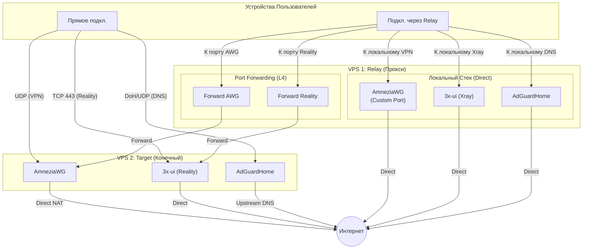

<!--
Name: 3x Architecture (Compact)
Description: Суть и правила проекта 3x-awg-adg-bundle для AI. Описывает топологию Direct (Target) и Proxy (Relay) серверов.
-->

# Архитектура 3x-awg-adg-bundle

Если рядом есть `.test-local/AGENTS.md`, учитывать его как локальное дополнение к этим правилам. Содержимое этого файла не коммитить.

## 1. Суть и Стек

**Миссия:** "One-click" DPI-shield для VPS от **512MB RAM**.
**Стек:** AmneziaWG + Xray (Reality) + AdGuardHome (AGH).
**Цель:** Очищенный интернет (No Ads/SafeSearch) и обход блокировок "из коробки".

## 1.1. Источник истины по коду

- Основной источник истины для логики установки, конфигов и регрессий - `src/setup`.
- `setup.sh` считать собранным артефактом. При анализе и правках сначала читать модули из `src/setup`, а `setup.sh` открывать только если нужно проверить итог сборки или совместимость с generated output.

## 2. Ключевые правила (Инварианты)

- **Идемпотентность**: Скрипт обновляет, но не ломает. Повторный запуск — безопасен.
- **Изоляция DNS**: Никаких утечек. Весь трафик (VPN/Proxy) обязан идти через AGH.
- **Порт 443**: Зарезервирован строго под Reality.
- **Root-Only**: Управление ядром и фаерволом требует прав суперпользователя.
- **Версия скрипта**: При любой правке `setup.sh` обязательно увеличивать `SCRIPT_VERSION` и обновлять проверку версии в регрессионных тестах. Это нужно, чтобы отличать новую сборку от старых копий и не запускать неактуальный инсталлятор.

## 3. Логика маршрутизации

- **Direct Egress**: Трафик из AmneziaWG и Xray уходит в интернет напрямую через MASQUERADE (NAT) без промежуточного TProxy.
- **DNS Hub**: AGH работает автономно. Клиенты подключаются к нему напрямую (UDP/DoH/DoT). Перехват DNS-трафика (DNAT 53) может использоваться только для принудительного направления в AGH.

## 4. Безопасность и Жизненный цикл

- **Obscurity**: Случайные порты, пароли и пути при каждой установке.
- **Hardening**: UFW + Fail2Ban + SSH (2244) + сетап BBR/sysctl.
- **Очистка**: Удаление инструментов сборки (`git`, `make`) сразу после компиляции.

## 5. Сценарии развертывания

Проект поддерживает две стратегии установки, которые могут комбинироваться для обхода жестких блокировок.

### Сценарий A: Target (Прямой)
Автономный сервер с полным стеком. Все входящие подключения приходят напрямую, исходящие уходят в интернет. Используется как конечная точка (выходной узел).

### Сценарий B: Relay (Проксирующий)
Сервер-"прослойка", который:
1. **Forwarding**: Пробрасывает трафик (L3/L4) на Target-сервер без распаковки (для скрытия реального IP Target-сервера).
2. **Local Services**: Имеет собственный стек (AWG, 3x, AGH) для локального использования, работающий напрямую в интернет.
3. **Optimization**: AWG на Relay-сервере использует нестандартные порты и оптимизированные параметры MTU/Server.

## 6. Топология

