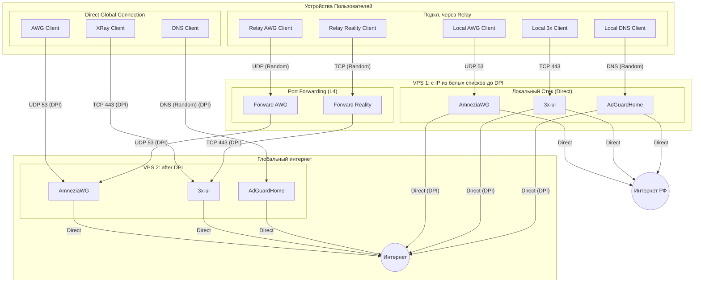

<!--
Name: 3x Architecture (Compact)
Description: Суть и правила проекта 3x-awg-adg-bundle для AI. Описывает топологию серверов.
-->

# Архитектура 3x-awg-adg-bundle

`.test-local/AGENTS.md` содержит сведения о подключении к серверу для отладки скрипта.

## 1. Суть и Стек

**Миссия:** Инсталятор системы обхода белых списков и DPI для 2 VPS c **512MB RAM**.
**Стек:** AmneziaWG + 3x-ui (Reality) + AdGuardHome (AGH).
**Цель:** Очищенный интернет (No Ads/SafeSearch) и обход устойчивый блокировок "из коробки".

## 1.1. Источник истины по коду

- Основной источник истины для логики установки, конфигов и регрессий - `src/setup`.
- `setup.sh` считать собранным артефактом. При анализе и правках сначала читать модули из `src/setup`, а `setup.sh` открывать только если нужно проверить итог сборки или совместимость с generated output.

## 2. Ключевые правила (Инварианты)

- **Идемпотентность**: Скрипт обновляет, но не ломает. Повторный запуск — безопасен.
- **Порт 443**: Зарезервирован строго под Reality.
- **Root-Only**: Управление ядром и фаерволом требует прав суперпользователя.
- **Версия скрипта**: При любой правке `setup.sh` обязательно увеличивать `SCRIPT_VERSION` и обновлять проверку версии в регрессионных тестах. Это нужно, чтобы отличать новую сборку от старых копий и не запускать неактуальный инсталлятор

## 4. Безопасность и Жизненный цикл

- **3 режима**:
  ---------------

  - Режим освежения: чинит, настраивает, но не меняет.
  - Режим изменения: меняются случайные порты, логины, пароли, токены и т.п. там где можно через CLI.
  - Режим удаления: удаляются все следы
- Для скорости: если сегодня обновления linux запускалось, то повторно оно не запускается.
- **Hardening**: UFW + Fail2Ban + SSH (2244) + сетап BBR/sysctl.
- **Очистка**: Чистка от всего лишнего после установки. На сервере 8GB HDD.
- Прозрачность и трассируемость: Легко отследить что пошло не так, на каком шаге.
- Применение TDD.
- При существенных изменениях актуализировать readme (en+ru)

## 5. Сценарии развертывания

Проект поддерживает две стратегии установки, которые могут комбинироваться для обхода жестких блокировок.

## 6. Топология

