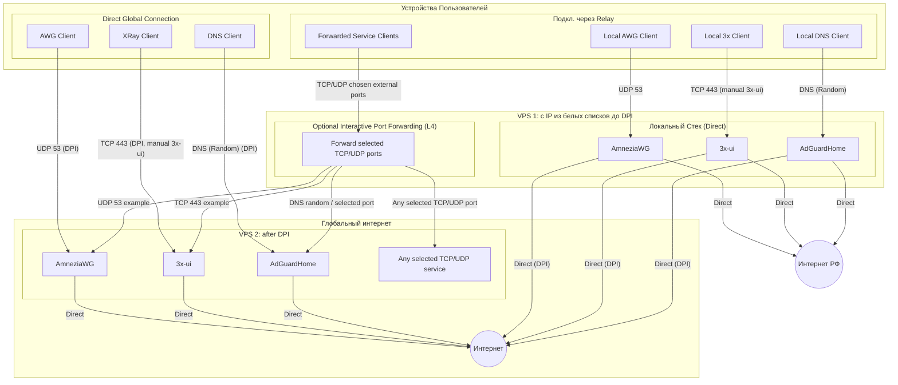

<!--
Name: 3x Architecture (Compact)
Description: Суть и правила проекта 3x-awg-adg-bundle для AI. Описывает топологию серверов.
-->

# Архитектура 3x-awg-adg-bundle

`.test-local/AGENTS.md` содержит сведения о подключении к серверу для отладки скрипта.

## 1. Суть и Стек

**Миссия:** Инсталятор системы обхода белых списков и DPI для 2 VPS c **512MB RAM**.
**Стек:** AmneziaWG + 3x-ui (Reality) + AdGuardHome (AGH).
**Цель:** Очищенный интернет (No Ads/SafeSearch) и обход устойчивый блокировок "из коробки".

## 1.1. Источник истины по коду

- Основной источник истины для логики установки, конфигов и регрессий - `src/setup`.
- `setup.sh` считать собранным артефактом. При анализе и правках сначала читать модули из `src/setup`, а `setup.sh` открывать только если нужно проверить итог сборки или совместимость с generated output.

## 2. Ключевые правила (Инварианты)

- **Идемпотентность**: Скрипт обновляет, но не ломает. Повторный запуск — безопасен.
- **Порт 443**: Зарезервирован строго под Reality.
- **Root-Only**: Управление ядром и фаерволом требует прав суперпользователя.
- **Версия скрипта**: При любой правке `setup.sh` обязательно увеличивать `SCRIPT_VERSION` и обновлять проверку версии в регрессионных тестах. Это нужно, чтобы отличать новую сборку от старых копий и не запускать неактуальный инсталлятор

## 3. 3x-ui, Reality и публичные панели

- **3x-ui настраивается вручную**: скрипт запускает официальный интерактивный installer, но не делает silent install, не создает Reality inbound и не выпускает клиентские ссылки автоматически.
- **Связи Reality на схеме** означают целевое рабочее состояние после ручной настройки `3x-ui` оператором.
- **Проверка 3x-ui не является критичной частью базовой валидации**, потому что скрипт не владеет ручной конфигурацией панели и inbound. Критично проверять только то, что скрипт настраивает сам: AmneziaWG, AdGuardHome, firewall и port forwarding. Проверка `3x-ui` допустима только как мягкое предупреждение или отдельная post-handoff диагностика.
- **AdGuardHome Web UI открыт публично** по случайному web-порту. Это ожидаемое поведение.
- **3x-ui panel и Reality доступны публично** после ручной настройки оператором и открытия нужных портов. Скрипт должен сохранять `443/tcp` под Reality и не закрывать публичный доступ к панели, если оператор выбрал отдельный порт.

## 4. Безопасность и Жизненный цикл

- **3 режима**:
  - Режим освежения: чинит, настраивает, но не меняет.
  - Режим изменения: меняются случайные порты, логины, пароли, токены и т.п. там где можно через CLI.
  - Режим удаления: удаляются все следы
- Для скорости: если сегодня обновления linux запускалось, то повторно оно не запускается.
- **Hardening**: UFW + Fail2Ban + SSH (2244) + сетап BBR/sysctl.
- **Очистка**: Чистка от всего лишнего после установки. На сервере 8GB HDD.
- Прозрачность и трассируемость: Легко отследить что пошло не так, на каком шаге.
- Применение TDD.
- При существенных изменениях актуализировать readme (en+ru)

## 5. Сценарии развертывания

Проект поддерживает единую модель установки: каждый VPS получает локальный direct-стек `AmneziaWG + 3x-ui + AdGuardHome`, а режим relay включается интерактивной настройкой port forwarding.

- **Target / удаленный сервер**: устанавливается так же, как обычный сервер. Если проброс портов с него дальше не нужен, оператор отвечает `no` на вопрос о forwarding.
- **Relay / ближайший сервер**: устанавливается тем же скриптом, но оператор отвечает `yes` на вопрос о forwarding и интерактивно добавляет целевые серверы и порты.
- **Port forwarding не должен быть ограничен только AWG и Reality**. Оператор должен иметь возможность добавить любой набор TCP/UDP-портов для одного или нескольких target IP.
- **Выбор внешнего порта relay**: если целевой порт свободен на текущем сервере, он используется как внешний порт. Если занят, скрипт подбирает случайный свободный порт на текущем сервере.
- **DNS endpoint AdGuardHome** на случайном порту является частью public data-plane, если он выводится пользователю как публичный endpoint. Firewall не должен блокировать этот порт на публичном интерфейсе.
- **NetRu и Net на схеме** - логические зоны до DPI и после DPI. Скрипт не должен делать отдельную маршрутизацию для "Интернет РФ" и "обычного интернета": технически это обычный direct egress через публичный интерфейс сервера.

## 6. Топология

