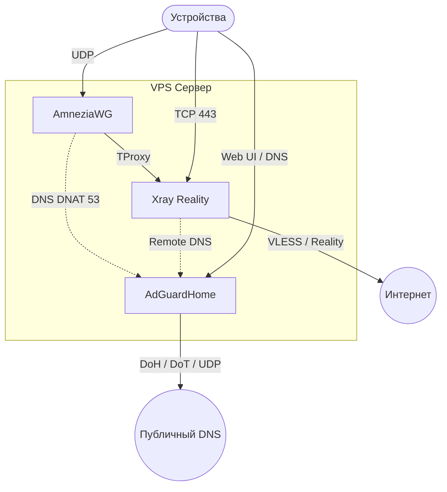

<!--
Name: Xray Reality Bundle Guide
Description: Documentation for the automated VPN/DNS bundle (Xray Reality, AmneziaWG, AdGuardHome).
Usage: Read before running setup.sh or uninstall.sh.
Behavior: Explains the direct Xray install flow, generated outputs, and cleanup path.
Returns: Operator reference for the current bundle layout.
Fails: N/A.
-->

# 3x-awg-adg-bundle

Auto-deploys a compact VPN/DNS stack for a VPS: **AmneziaWG**, **Xray Reality**, and **AdGuardHome**.
The installer configures Xray directly. Panel-based management is not part of the default path anymore.

[🇷🇺 Перейти к русской версии](#russian) | [🇺🇸 Switch to English version](#english)

---

## <span id="russian"></span>🇷🇺 Русский

Этот проект превращает чистый VPS в связку из трёх компонентов:
- AmneziaWG для VPN-доступа.
- Xray Reality на `443`.
- AdGuardHome для DNS-фильтрации и SafeSearch.
- Опциональный каскад через внешний `VLESS Reality` upstream для non-RU AWG-трафика.

### Топология



### Что делает `setup.sh`

- Устанавливает `Xray-core 25.1.30` через официальный installer и не откатывается обратно на `latest` при повторном запуске.
- Пишет конфиг в `/usr/local/etc/xray/config.json`.
- Удаляет legacy `x-ui`, если он остался от предыдущих версий, чтобы не было split-brain control plane.
- Поднимает `VLESS + Reality + Vision` inbound на `443`.
- Держит единый `tproxy-in` inbound Xray c `network = "tcp,udp"` и `sockopt.tproxy = "tproxy"` без `sockopt.mark = 1`.
- Опционально включает cascade mode через `--cascade-vless`, где non-RU AWG-трафик идёт через внешний `VLESS Reality` upstream, RU-домены и RU-IP остаются на локальном выходе, а при падении upstream Xray автоматически уходит в `direct-out`.
- Генерирует и печатает `vless://` ссылку.
- Настраивает AmneziaWG, TProxy, DNS DNAT и AdGuardHome.
- Добавляет явное INPUT-исключение для `awg0` marked TProxy-трафика, чтобы `UFW` не дропал VPN-клиентский интернет в `ufw-not-local`.
- Оставляет клиентский профиль AmneziaWG IPv4-only (`AllowedIPs = 0.0.0.0/0`) до полноценной реализации IPv6-маршрутизации.
- Включает базовое hardening: `UFW`, `Fail2Ban`, `BBR`, `sysctl`, SSH на `2244`.

### Установка

```bash
sudo curl -fsSL https://raw.githubusercontent.com/SpIvanM/3x-awg-adg-bundle/main/setup.sh | sudo bash
```

### Установка с каскадом

```bash
sudo curl -fsSL https://raw.githubusercontent.com/SpIvanM/3x-awg-adg-bundle/main/setup.sh | \
  sudo bash -s -- --cascade-vless 'vless://UUID@host:443?type=tcp&security=reality&encryption=none&pbk=...&sni=...&sid=...'
```

- В `v1` принимается только `vless://` c `type=tcp`, `security=reality`, `encryption=none`.
- `--cascade-mode auto` можно передать явно, но это единственный поддерживаемый режим и он же включается по умолчанию вместе с `--cascade-vless`.

### Повторный запуск с ротацией

```bash
sudo curl -fsSL https://raw.githubusercontent.com/SpIvanM/3x-awg-adg-bundle/main/setup.sh | sudo bash -s -- --rotate
```

- Повторный запуск без `--rotate` должен переиспользовать текущие credentials `Xray`, `AdGuardHome` и `AmneziaWG`, а не пересоздавать клиентский AWG-профиль.
- При повторном запуске сохранённые credentials и восстановленные значения из существующих конфигов нормализуются от `CRLF`, чтобы Windows-переносы строк не попадали внутрь `Xray` JSON и `AWG`/`AGH` runtime-конфигов.
- Если повторный запуск делается без `--cascade-vless`, скрипт возвращает dataplane в `direct-exit` режим и переписывает `CASCADE_*` поля в credentials.

### Удаление

```bash
sudo curl -fsSL https://raw.githubusercontent.com/SpIvanM/3x-awg-adg-bundle/main/uninstall.sh | sudo bash
```

### Важные заметки

- Ссылки, пароли и QR-коды сохраняются в `/root/.vpn-credentials`.
- Дефолтная `VLESS` ссылка печатается самим `setup.sh` после генерации Reality-ключей.
- `Hysteria2` не входит в автоматический inbound-путь этого репозитория. Если нужен именно он, добавляй его отдельно, вне базового сценария.
- После первой установки нужен `sudo reboot`.

---

## <span id="english"></span>🇺🇸 English

This repo turns a clean VPS into a three-part stack:
- AmneziaWG for VPN access.
- Xray Reality on port `443`.
- AdGuardHome for DNS filtering and SafeSearch.
- An optional `VLESS Reality` cascade upstream for non-RU AWG traffic.

### Topology


### What `setup.sh` does

- Installs `Xray-core 25.1.30` using the official installer and keeps that pinned version on re-runs.
- Writes the config to `/usr/local/etc/xray/config.json`.
- Removes legacy `x-ui` leftovers on re-runs so the host keeps a single Xray control plane.
- Creates a `VLESS + Reality + Vision` inbound on port `443`.
- Keeps a single Xray `tproxy-in` inbound with `network = "tcp,udp"` and `sockopt.tproxy = "tproxy"` only.
- Optionally enables cascade mode through `--cascade-vless`, where non-RU AWG traffic uses an upstream `VLESS Reality` exit, RU domains and RU IPs stay local, and Xray falls back to `direct-out` when the upstream is unhealthy.
- Prints a `vless://` link.
- Sets up AmneziaWG, TProxy, DNS DNAT, and AdGuardHome.
- Adds an explicit INPUT allow rule for `awg0` TProxy-marked packets so `UFW` does not drop VPN internet traffic in `ufw-not-local`.
- Ships the AmneziaWG client profile as IPv4-only (`AllowedIPs = 0.0.0.0/0`) until IPv6 routing is implemented intentionally.
- Enables baseline hardening: `UFW`, `Fail2Ban`, `BBR`, `sysctl`, SSH on `2244`.

### Install

```bash
sudo curl -fsSL https://raw.githubusercontent.com/SpIvanM/3x-awg-adg-bundle/main/setup.sh | sudo bash
```

### Install with cascade

```bash
sudo curl -fsSL https://raw.githubusercontent.com/SpIvanM/3x-awg-adg-bundle/main/setup.sh | \
  sudo bash -s -- --cascade-vless 'vless://UUID@host:443?type=tcp&security=reality&encryption=none&pbk=...&sni=...&sid=...'
```

- `v1` only accepts `vless://` links with `type=tcp`, `security=reality`, and `encryption=none`.
- `--cascade-mode auto` is the only supported mode and is implied when `--cascade-vless` is present.

### Re-run with rotation

```bash
sudo curl -fsSL https://raw.githubusercontent.com/SpIvanM/3x-awg-adg-bundle/main/setup.sh | sudo bash -s -- --rotate
```

- A re-run without `--rotate` is expected to reuse the current `Xray`, `AdGuardHome`, and `AmneziaWG` credentials instead of replacing the active AWG client profile.
- A re-run without `--cascade-vless` returns the dataplane to `direct-exit` mode and rewrites the persisted `CASCADE_*` values.

### Uninstall

```bash
sudo curl -fsSL https://raw.githubusercontent.com/SpIvanM/3x-awg-adg-bundle/main/uninstall.sh | sudo bash
```

### Notes

- Links, passwords, and QR codes are stored in `/root/.vpn-credentials`.
- The default `VLESS` link is printed by `setup.sh` after Reality keys are generated.
- `Hysteria2` is not part of the automated inbound flow in this repo. If you need it, add it separately outside the default path.
- A `sudo reboot` is required after the first install.
