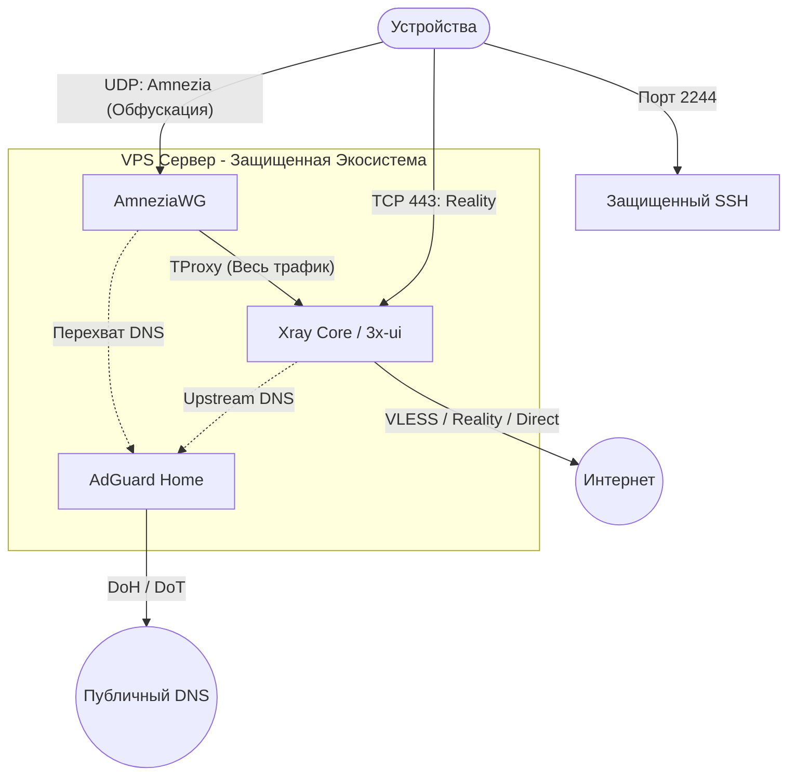
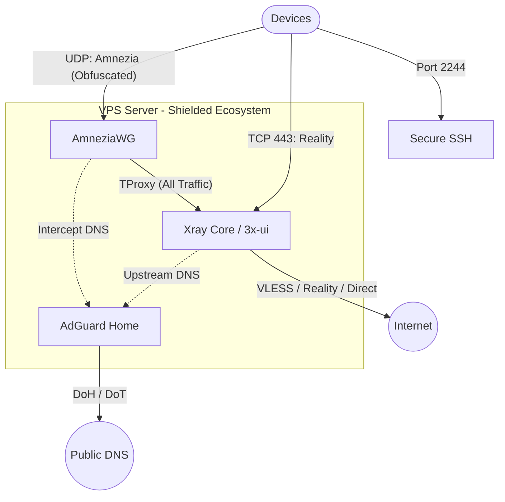

<!--
Name: 3x-awg-adg-bundle Comprehensive Guide
Description: Documentation for the automated VPN/DNS triad (3x-ui, AmneziaWG, AdGuardHome).
Usage: Refer to installation commands below.
Behavior: Provides installation/uninstallation instructions, architectural overview, and security details.
Returns: Structured project overview.
Fails: n/a
-->

# 🛡️ 3x-awg-adg-bundle

**The Ultimate "One-Click" Shield for your VPS.**  
Auto-deploy a professional-grade VPN ecosystem featuring **AmneziaWG**, **3x-ui (Xray)**, and **AdGuardHome**.

[🇷🇺 Перейти к описанию на русском](#russian) | [🇺🇸 Switch to English description](#english)

---

## <span id="russian"></span>🇷🇺 Русский

Этот проект превращает чистый VPS в мощный, защищенный интернет-шлюз за 5 минут. Мы объединили лучшие инструменты обхода блокировок и фильтрации рекламы в одну связную систему.

### 🧩 Топология сети



### 🚀 Преимущества связки

1.  **DPI-Shield (AmneziaWG)**: Специальная версия WireGuard с модифицированными заголовками пакетов. Она выглядит как "шум" для систем глубокого анализа трафика (ТСПУ), что позволяет обходить блокировки, которые убивают обычный WireGuard.
2.  **Двойная фильтрация (AdGuardHome)**: Весь ваш VPN-трафик проходит через AGH. Это убирает рекламу, трекеры и обеспечивает **Безопасный поиск** на уровне сети для всех подключенных устройств.
3.  **Гибкость Xray (Reality)**: В комплекте идет панель 3x-ui, настроенная на работу через 443 порт с протоколом Reality. Это делает ваш прокси-трафик неотличимым от посещения популярного сайта (например, Microsoft или Apple).
4.  **Умная маршрутизация (TProxy)**: Весь трафик из VPN автоматически попадает в Xray. Это позволяет реализовать сложные сценарии: например, отправлять часть трафика через цепочку других прокси.
5.  **Hardening "из коробки"**: Скрипт меняет SSH на порт 2244, включает BBR для ускорения интернета и настраивает оптимальные параметры ядра.

### 🛠️ Установка

```bash
curl -fsSL https://raw.githubusercontent.com/SpIvanM/3x-awg-adg-bundle/main/setup.sh | sudo bash
```

### 🧹 Удаление
```bash
curl -fsSL https://raw.githubusercontent.com/SpIvanM/3x-awg-adg-bundle/main/uninstall.sh | sudo bash
```

### ⚠️ Важные примечания
- **Перезагрузка**: Обязательно выполните `sudo reboot` после первой установки.
- **Учетные данные**: Все ссылки, пароли и QR-коды для подключения сохраняются в `/root/.vpn-credentials`.

---

## <span id="english"></span>🇺🇸 English

Transform a clean VPS into a robust, high-performance internet gateway in 5 minutes. We combine the best-in-class censorship-bypass tools and ad-filtering solutions into a seamless ecosystem.

### 🧩 Network Topology



### 💎 Key Advantages

1.  **DPI-Shield (AmneziaWG)**: A specialized WireGuard implementation with modified packet headers. It looks like random noise to Deep Packet Inspection (DPI) systems, bypassing blocks that "kill" standard WireGuard.
2.  **DNS-Level Protection (AdGuardHome)**: All VPN traffic is routed through AGH. This eliminates ads, and trackers, and enforces **SafeSearch** across all connected devices directly at the network level.
3.  **Stealth Proximization (Reality)**: The bundle includes the 3x-ui panel pre-configured with VLESS-Reality on port 443. This masks your proxy traffic as legitimate HTTPS traffic to popular websites.
4.  **Cascading Routing (TProxy)**: Traffic from the VPN is transparently proxied into Xray. This allows for advanced routing logic, such as chaining multiple proxies or selective routing.
5.  **Out-of-the-Box Hardening**: Automatically updates SSH to port 2244, enables BBR for traffic optimization, and applies security sysctl tweaks.

### 🛠️ Installation

```bash
curl -fsSL https://raw.githubusercontent.com/SpIvanM/3x-awg-adg-bundle/main/setup.sh | sudo bash
```

### 🧹 Uninstallation
```bash
curl -fsSL https://raw.githubusercontent.com/SpIvanM/3x-awg-adg-bundle/main/uninstall.sh | sudo bash
```

### ⚠️ Important Notes
- **Reboot**: A `sudo reboot` is mandatory after the initial installation.
- **Credentials**: All generated access links, passwords, and QR codes are stored in `/root/.vpn-credentials` for your convenience.
