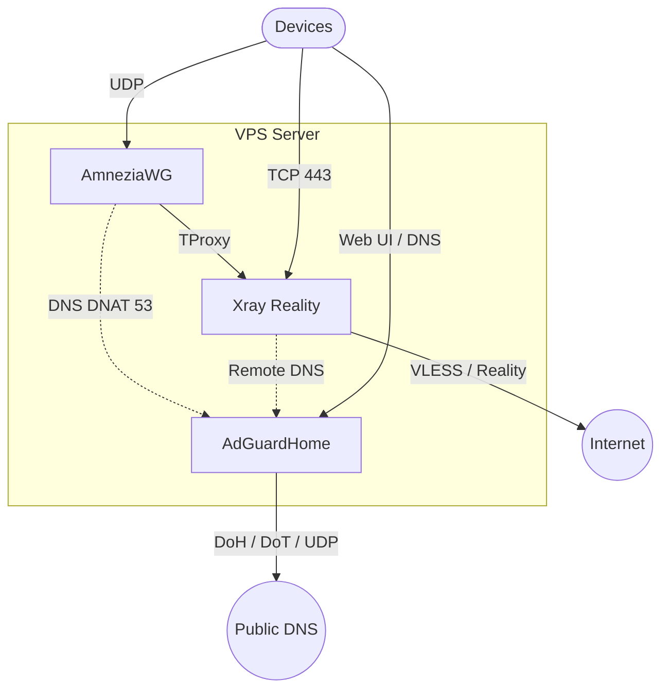

<!--
Name: Xray Reality Bundle Guide
Description: Documentation for the automated VPN/DNS bundle (Xray Reality, AmneziaWG, AdGuardHome).
Usage: Read before running setup.sh or uninstall.sh.
Behavior: Explains the direct Xray install flow, generated outputs, and cleanup path.
Returns: Operator reference for the current bundle layout.
Fails: N/A.
-->

# 3x-awg-adg-bundle

Auto-deploys a compact VPN/DNS stack for a VPS: **AmneziaWG**, **Xray Reality**, and **AdGuardHome**.
The installer configures Xray directly. Panel-based management is not part of the default path anymore.

[🇷🇺 Перейти к русской версии](#russian) | [🇺🇸 Switch to English version](#english)

---

## <span id="russian"></span>🇷🇺 Русский

Этот проект превращает чистый VPS в связку из трёх компонентов:
- AmneziaWG для VPN-доступа.
- Xray Reality на `443`.
- AdGuardHome для DNS-фильтрации и SafeSearch.

### Топология


### Что делает `setup.sh`

- Устанавливает Xray-core через официальный installer.
- Пишет конфиг в `/usr/local/etc/xray/config.json`.
- Поднимает `VLESS + Reality + Vision` inbound на `443`.
- Генерирует и печатает `vless://` ссылку.
- Настраивает AmneziaWG, TProxy, DNS DNAT и AdGuardHome.
- Включает базовое hardening: `UFW`, `Fail2Ban`, `BBR`, `sysctl`, SSH на `2244`.

### Установка

```bash
sudo curl -fsSL https://raw.githubusercontent.com/SpIvanM/3x-awg-adg-bundle/main/setup.sh | sudo bash
```

### Повторный запуск с ротацией

```bash
sudo curl -fsSL https://raw.githubusercontent.com/SpIvanM/3x-awg-adg-bundle/main/setup.sh | sudo bash -s -- --rotate
```

### Удаление

```bash
sudo curl -fsSL https://raw.githubusercontent.com/SpIvanM/3x-awg-adg-bundle/main/uninstall.sh | sudo bash
```

### Важные заметки

- Ссылки, пароли и QR-коды сохраняются в `/root/.vpn-credentials`.
- Дефолтная `VLESS` ссылка печатается самим `setup.sh` после генерации Reality-ключей.
- `Hysteria2` не входит в автоматический inbound-путь этого репозитория. Если нужен именно он, добавляй его отдельно, вне базового сценария.
- После первой установки нужен `sudo reboot`.

---

## <span id="english"></span>🇺🇸 English

This repo turns a clean VPS into a three-part stack:
- AmneziaWG for VPN access.
- Xray Reality on port `443`.
- AdGuardHome for DNS filtering and SafeSearch.

### Topology



### What `setup.sh` does

- Installs Xray-core using the official installer.
- Writes the config to `/usr/local/etc/xray/config.json`.
- Creates a `VLESS + Reality + Vision` inbound on port `443`.
- Prints a `vless://` link.
- Sets up AmneziaWG, TProxy, DNS DNAT, and AdGuardHome.
- Enables baseline hardening: `UFW`, `Fail2Ban`, `BBR`, `sysctl`, SSH on `2244`.

### Install

```bash
sudo curl -fsSL https://raw.githubusercontent.com/SpIvanM/3x-awg-adg-bundle/main/setup.sh | sudo bash
```

### Re-run with rotation

```bash
sudo curl -fsSL https://raw.githubusercontent.com/SpIvanM/3x-awg-adg-bundle/main/setup.sh | sudo bash -s -- --rotate
```

### Uninstall

```bash
sudo curl -fsSL https://raw.githubusercontent.com/SpIvanM/3x-awg-adg-bundle/main/uninstall.sh | sudo bash
```

### Notes

- Links, passwords, and QR codes are stored in `/root/.vpn-credentials`.
- The default `VLESS` link is printed by `setup.sh` after Reality keys are generated.
- `Hysteria2` is not part of the automated inbound flow in this repo. If you need it, add it separately outside the default path.
- A `sudo reboot` is required after the first install.