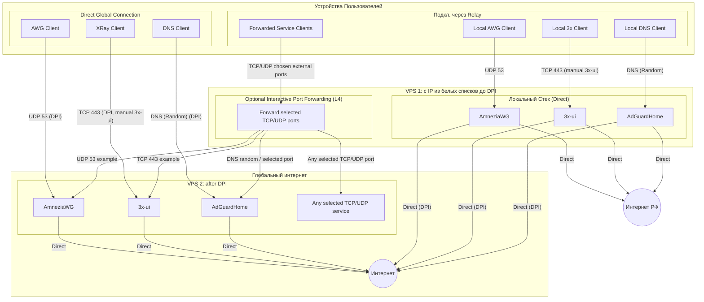

<!--
Name: 3x Bundle Guide
Description: Документация по инсталлятору 3x-awg-adg-bundle. Версия 3.1.2 поддерживает target, relay-local direct stack, универсальный проброс портов и визуальную схему топологии.
Usage: Read before running setup.sh or uninstall.sh.
Behavior: Explains target, relay-local stack, transparent relay forwarding, manual 3x-ui handoff, generated outputs, and topology visualization.
Returns: Operator reference for the current bundle layout.
Fails: N/A.
-->

# 3x-awg-adg-bundle

Stage-based installer for a compact VPS stack: **3x-ui**, **AmneziaWG**, and **AdGuardHome**.
Version `3.1.2` supports a unified local direct stack on every server, optional universal interactive port forwarding, and targeted lifecycle cleanup.

[🇷🇺 Перейти к русской версии](#russian) | [🇺🇸 Switch to English version](#english)

---

## <span id="russian"></span>🇷🇺 Русский

### Что сейчас умеет проект

- Запускает официальный интерактивный installer `3x-ui`.
- Не делает silent install и не конфигурирует `3x-ui` автоматически.
- Поднимает `AmneziaWG` на `53/udp` с `MTU 1280` и `AdGuardHome` как direct-стек текущего этапа (публичный DNS endpoint открыт в firewall).
- В режиме `--mode relay` интерактивно запрашивает настройку проброса портов через `/dev/tty`.
- **Проброс опционален и универсален:** можно пробрасывать любые TCP/UDP порты на несколько target-серверов. Скрипт сам подберет внешние порты и настроит DNAT/FORWARD/MASQUERADE. Не ограничен портами AWG и Reality.
- Сохраняет правила проброса (target IP, порты, протоколы) в `/root/.vpn-forwarding-rules`.
- Сохраняет credentials для `AWG` и `AdGuardHome` в `/root/.vpn-credentials`.
- Оставляет порт `443` зарезервированным под `Reality`, но сам inbound и клиентские ссылки оператор настраивает вручную уже внутри `3x-ui`.

### Топология




### Ограничения

- `setup.sh` не делает silent install и не выполняет auto-config `3x-ui`.
- Reality inbound, клиенты и подписки настраиваются вручную в панели `3x-ui`.
- `setup.sh` больше не хранит и не генерирует legacy `Xray/cascade` конфиг, `CASCADE_*`, `VLESS_LINK` и `ADG_HTTP_PROXY_PORT`.

### Что делает `setup.sh`

- Обновляет базовую систему и ставит обязательные пакеты.
- Готовит `sysctl`, `BBR`, `swapfile`, `UFW`, `Fail2Ban`, SSH на `2244`.
- Собирает и настраивает `AmneziaWG` на `53/udp`, прописывает `MTU 1280` в серверный и клиентский конфиг.
- Устанавливает и настраивает `AdGuardHome` без HTTP proxy-зависимости от `Xray`.
- Запускает официальный installer `3x-ui` через `/dev/tty`, чтобы оператор прошёл ручной интерактивный flow.
- После installer-а выводит handoff: дальнейшая настройка панели, `Reality` inbound и клиентских ссылок выполняется вручную вне скрипта.
- В режиме `target` печатает target-данные для следующего сервера: IP, `AWG 53/udp`, `Reality 443/tcp`, DNS endpoint AdGuardHome.
- В режиме `relay` печатает отдельные блоки `Relay local direct stack` и активные `Relay-forward endpoints`.

Официальная команда installer-а `3x-ui` сверена с первичным источником: [MHSanaei/3x-ui Wiki](https://github.com/MHSanaei/3x-ui/wiki/Installation) и [репозиторием MHSanaei/3x-ui](https://github.com/MHSanaei/3x-ui).

### Установка

```bash
sudo curl -fsSL https://raw.githubusercontent.com/SpIvanM/3x-awg-adg-bundle/main/setup.sh | sudo bash
```

### Установка relay-local стека

```bash
sudo curl -fsSL https://raw.githubusercontent.com/SpIvanM/3x-awg-adg-bundle/main/setup.sh | sudo bash -s -- --mode relay
```

### Повторный запуск с ротацией

```bash
sudo curl -fsSL https://raw.githubusercontent.com/SpIvanM/3x-awg-adg-bundle/main/setup.sh | sudo bash -s -- --rotate
```

### Управление пробросом портов (fwd.sh)

Если вам нужно изменить правила проброса портов без переустановки всего стека, используйте инструмент `fwd.sh`.

**Возможности:**
- Просмотр текущих правил в формате `Protocol: IP:Port -> ExternalPort`.
- Очистка старых правил `iptables` и файла состояния.
- Интерактивное добавление новых серверов и портов.
- Автоматический поиск свободного внешнего порта при конфликтах.

**Запуск:**
```bash
# Напрямую из репозитория:
sudo curl -fsSL https://raw.githubusercontent.com/SpIvanM/3x-awg-adg-bundle/main/tools/fwd.sh | sudo bash

# Или локально (если репозиторий клонирован):
sudo bash tools/fwd.sh
```


### Что настроить вручную после installer-а `3x-ui`

1. Завершить мастер installer-а `3x-ui`.
2. Создать и настроить `Reality` inbound внутри панели.
3. Выпустить клиентские ссылки или подписки уже средствами `3x-ui`.
4. Если панель использует отдельный порт, открыть его в `UFW` вручную.

### Удаление

```bash
sudo curl -fsSL https://raw.githubusercontent.com/SpIvanM/3x-awg-adg-bundle/main/uninstall.sh | sudo bash
```

`uninstall.sh` останавливает и удаляет 3x-ui, AmneziaWG и AdGuardHome; cleanup удаляет только owned forwarding-правила bundle по comment-маркерам и не делает глобальный `ufw reset`.

### Важные заметки

- Источник истины по логике установки: `src/setup`, а не собранный `setup.sh`.
- Публичный `setup.sh` собирается через [`tools/build-setup.ps1`](tools/build-setup.ps1).
- Порядок и назначение модулей описаны в [`src/setup/README.md`](src/setup/README.md).
- После первой установки нужен `sudo reboot`.

---

## <span id="english"></span>🇺🇸 English

### Current project scope

- Runs the official interactive `3x-ui` installer.
- Does not perform silent install and does not auto-configure `3x-ui`.
- Brings up `AmneziaWG` on `53/udp` with `MTU 1280` and `AdGuardHome` as the direct stack for the current stage (public DNS endpoint is open in the firewall).
- In `--mode relay`, prompts for optional interactive port forwarding through `/dev/tty`.
- **Forwarding is universal:** you can forward any TCP/UDP ports to multiple target servers. The script auto-assigns external ports and configures DNAT/FORWARD/MASQUERADE. It is not limited to AWG and Reality.
- Stores forwarding rules in `/root/.vpn-forwarding-rules`.
- Stores `AWG` and `AdGuardHome` credentials in `/root/.vpn-credentials`.
- Keeps port `443` reserved for `Reality`, but the inbound and client links are configured manually by the operator inside `3x-ui`.

### Topology


### Limitations

- `setup.sh` does not perform silent install or auto-configure `3x-ui`.
- Reality inbound, clients, and subscriptions are configured manually inside the `3x-ui` panel.
- `setup.sh` no longer stores or generates the legacy `Xray/cascade` config, `CASCADE_*`, `VLESS_LINK`, or `ADG_HTTP_PROXY_PORT`.

### What `setup.sh` does

- Updates the base OS and installs required packages.
- Prepares `sysctl`, `BBR`, `swapfile`, `UFW`, `Fail2Ban`, and SSH on `2244`.
- Builds and configures `AmneziaWG` on `53/udp` and writes `MTU 1280` into the server and client configs.
- Installs and configures `AdGuardHome` without any `Xray` HTTP proxy dependency.
- Launches the official `3x-ui` installer through `/dev/tty` so the operator completes the interactive flow manually.
- Prints a handoff after the installer: panel setup, `Reality` inbound creation, and client link generation are handled manually outside the script.
- In `target` mode, prints target details for the next server: IP, `AWG 53/udp`, `Reality 443/tcp`, and the AdGuardHome DNS endpoint.
- In `relay` mode, prints separate `Relay local direct stack` and active `Relay-forward endpoints` blocks.

The `3x-ui` installer command was verified against the primary sources: [MHSanaei/3x-ui Wiki](https://github.com/MHSanaei/3x-ui/wiki/Installation) and the [MHSanaei/3x-ui repository](https://github.com/MHSanaei/3x-ui).

### Install

```bash
sudo curl -fsSL https://raw.githubusercontent.com/SpIvanM/3x-awg-adg-bundle/main/setup.sh | sudo bash
```

### Install relay-local stack

```bash
sudo curl -fsSL https://raw.githubusercontent.com/SpIvanM/3x-awg-adg-bundle/main/setup.sh | sudo bash -s -- --mode relay
```

### Re-run with rotation

```bash
sudo curl -fsSL https://raw.githubusercontent.com/SpIvanM/3x-awg-adg-bundle/main/setup.sh | sudo bash -s -- --rotate
```

### Port Forwarding Management (fwd.sh)

If you need to modify port forwarding rules without reinstalling the entire stack, use the `fwd.sh` tool.

**Features:**
- View current rules in `Protocol: IP:Port -> ExternalPort` format.
- Clean up old `iptables` rules and state file.
- Interactively add new target servers and ports.
- Automatic free external port selection in case of conflicts.

**Usage:**
```bash
# Directly from the repository:
sudo curl -fsSL https://raw.githubusercontent.com/SpIvanM/3x-awg-adg-bundle/main/tools/fwd.sh | sudo bash

# Or locally (if repository is cloned):
sudo bash tools/fwd.sh
```


### Manual steps after the `3x-ui` installer

1. Finish the `3x-ui` installer wizard.
2. Create and configure the `Reality` inbound inside the panel.
3. Generate client links or subscriptions from `3x-ui`.
4. If the panel uses a dedicated port, open it in `UFW` manually.

### Uninstall

```bash
sudo curl -fsSL https://raw.githubusercontent.com/SpIvanM/3x-awg-adg-bundle/main/uninstall.sh | sudo bash
```

`uninstall.sh` stops and removes 3x-ui, AmneziaWG, and AdGuardHome; its cleanup removes only bundle-owned forwarding rules by comment markers and does not run a global `ufw reset`.

### Notes

- The source of truth for installer logic is `src/setup`, not the assembled `setup.sh`.
- The public `setup.sh` is built through [`tools/build-setup.ps1`](tools/build-setup.ps1).
- Module order and responsibilities are documented in [`src/setup/README.md`](src/setup/README.md).
- A `sudo reboot` is required after the first install.
